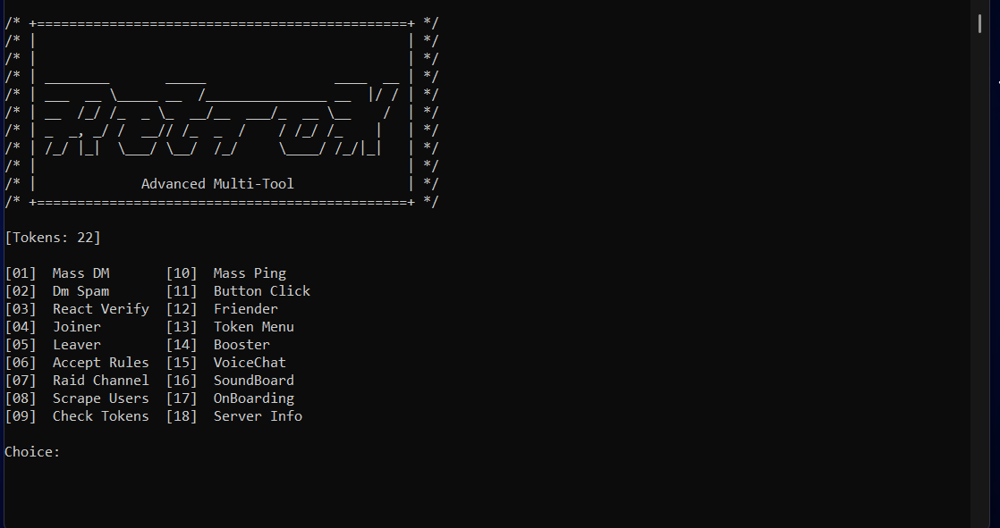

  <h1 align="left">RetroX-Advanced-Multi-Tool</h1>
  <p align="left">
    A fast, terminal-based multi-tool for Discord automation, crafted by <b>Draxo</b>.
  </p>
</p>

---

## Quick Links
- Introduction
- How it works
- Configuration


---

## About
<p align="center" style="text-align: center"> 
  
</p>

<p align="center" style="text-align: center"> 
  
</p>

## How it Works

### Architecture Overview
RetroX-Advanced-Multi-Tool is built using Go and leverages Discord's API to provide automated functionality. The application uses a modular architecture with separate components for different operations.

### File Structure
```
RetroX-Advanced-Multi-Tool/
├── main.go                 # Main application entry point
├── go.mod                  # Go module dependencies
├── go.sum                  # Dependency checksums
├── config.json             # Configuration file
├── tokens.txt              # Discord tokens (one per line)
├── proxies.txt             # Proxy list (optional)
├── data/                   # Data directory
│   ├── combo.txt          # Token combinations
│   ├── ids.txt            # Scraped user IDs
│   ├── valid.txt          # Valid tokens
│   ├── invalid.txt        # Invalid tokens
│   ├── joined.txt         # Successfully joined servers
│   ├── locked.txt         # Locked tokens
│   └── pfp/               # Profile pictures directory
├── src/                    # Source code
│   ├── client/            # HTTP client implementation
│   ├── modules/           # Core functionality modules
│   └── task/              # Task execution logic
├── Compiled/              # Compiled binaries
└── README.md              # This file
```

### Compilation Instructions

#### Prerequisites
- Go 1.20 or higher installed
- Git (for cloning the repository)

#### Building from Source
1. **Clone the repository:**
   ```bash
   git clone <repository-url>
   cd RetroX-Advanced-Multi-Tool
   ```

2. **Install dependencies:**
   ```bash
   go mod download
   ```

3. **Build the application:**
   ```bash
   # For your current platform
   go build -o RetroX.exe
   
   # For Windows (64-bit)
   GOOS=windows GOARCH=amd64 go build -o RetroX.exe
   
   # For Linux (64-bit)
   GOOS=linux GOARCH=amd64 go build -o RetroX
   
   # For macOS (64-bit)
   GOOS=darwin GOARCH=amd64 go build -o RetroX
   ```

4. **Run the application:**
   ```bash
   ./RetroX.exe  # Windows
   ./RetroX      # Linux/macOS
   ```

### How It Works

#### Core Components

1. **Instance Management (`src/modules/instance.go`)**
   - Manages Discord token instances
   - Handles browser fingerprinting and headers
   - Manages rate limiting and cooldowns

2. **HTTP Client (`src/client/`)**
   - Custom HTTP client with TLS fingerprinting
   - Proxy support for residential/datacenter proxies
   - Request/response handling with proper headers

3. **Task Execution (`src/task/task.go`)**
   - Concurrent task execution using goroutines
   - Rate limiting and error handling
   - Progress tracking and statistics

4. **Discord API Integration (`src/modules/godm.go`)**
   - Direct Discord API calls
   - WebSocket connections for real-time features
   - Message handling and channel management

#### Operation Flow

1. **Initialization:**
   - Loads configuration from `config.json`
   - Reads tokens from `tokens.txt`
   - Sets up HTTP clients with proper headers
   - Initializes browser fingerprints

2. **Token Processing:**
   - Validates tokens and checks their status
   - Creates individual instances for each token
   - Manages rate limits and cooldowns

3. **Task Execution:**
   - Distributes tasks across available tokens
   - Uses concurrent goroutines for parallel execution
   - Implements proper error handling and retry logic

4. **Result Management:**
   - Tracks success/failure rates
   - Logs results to appropriate files
   - Updates token status based on responses

#### Key Features

- **Concurrent Processing:** Uses Go's goroutines for parallel execution
- **Rate Limiting:** Built-in Discord rate limit handling
- **Proxy Support:** Residential and datacenter proxy support
- **Browser Fingerprinting:** Mimics real browser behavior
- **Error Recovery:** Automatic retry mechanisms for failed requests
- **Progress Tracking:** Real-time statistics and logging

## Usage
- Install Go: https://go.dev (version 1.20+)
- Or use a compiled release: https://github.com/Draxo-0/RetroX-Advanced-Multi-Tool/releases/tag/Compiled

```md
Inputs:
________________________________________________
  [0] Refreshes RetroX
  [1] Message & Scraped Ids in ids.txt
  [2] victims User ID
  [3] Channel ID & Message ID
  [4] Server invite
  [5] Server ID
  [6] Server Invite and Server ID
  [7] Channel ID & Message
  [8] Server ID & Channel ID
  [9] Tokens in tokens.txt
  [10] Channeld ID & Amount To ping in a single message 
  [11] Message Link & Button Type https://discord.com/developers/docs/interactions/message-components
  [12] Full Username / USER#0000
  [13] email:pass:token format / 10 options
  [14] Nitro Tokens in tokens.txt & server ID
  [15] Server ID & CHannel ID
  [16] SoundBoard Option & Channel ID
  [17] Server Invite & Options
  [18] Server Invite
________________________________________________

time logging: the logger will return in ms so 500ms, but if its 5.23ms than its 5s & 230ms
before scraping, have a atleast a single token within the list

> tokens can be in mail:pass:token format or only token format
> just make sure theyre inside tokens.txt and the separator is ":"
> also do not mix the formats together

Recommended:
> use 1 - 3000 tokens for stability
> above 20 mbps netspeed dependent on amount of tokens
________________________________________________
> RetroX creates a random context for each token, its not advised to restart RetroX after different functions.
> as it will automatically return to the menu

RetroX was made to be fast so even small amounts are enough for significant speeds
```

## Config

Proxy Type: Residential rotating / static list

Proxies available at:
- https://iproyal.com
- https://proxiware.com
- https://proxies.gg

Format: user:pass@ip:port

If using residential proxies, set them in `config.json`.
If using `proxies.txt`, use the same or more proxies than tokens.

Recommended Config:
```json
{
  "Modes": {
    "Config": {
      "Interval": 0,
      "CCManager": false,
      "MaxRoutines": 300,
      "SolveCaptcha": false,
      "CaptchaRetry": 2,
      "RateLimit": true
    },
    "Net": {
      "JA3": "772,4865-4866-49195-49199-49196-49200-52393-49171-49172-156-157-47-53,35-51-13-17513-45-10-65281-0-11-27-16-23-18-5-43,29-23-24,0",
      "Agent": "Mozilla/5.0 (Windows NT 10.0; Win64; x64) AppleWebKit/537.36 (KHTML, like Gecko) Chrome/114.0.0.0 Safari/537.366",
      "Proxy": "your-proxy-address",
      "WebKit": "537.36",
      "Redirect": false,
      "TimeOut": 50
    },
    "Discord": {
      "Ver": 2.0,
      "CapApi": ["captcha-service", "service-api-key"],
      "Presence": ["online", "dnd", "idle"], 
      "Message": [
        {
          "Title": "# Hey!",
          "Body": "> This Message Was sent using",
          "Link": "> https://github.com/yaboipy"
        },
        {
          "Title": "# Hello!",
          "Body": "> mind joining my server!",
          "Link": "> discord.gg/"
        }
      ]
    }
  }
}
```

**Config**
| Name | Type | Description |
| ---  | ---  | ---         |
| `Interval` | CONFIG | Global Time-[sec] before iterating 0 = instant iteration
| `SolveCaptcha` | CAPTCHA | Solves The Capthca Using Api
| `CCManager` | PROCESS | False will have no limit to MaxRountines
| `MaxRoutines` | PROCESS | The Max ammount of Concurrent WaitGroups allowed to run
| `CaptchaRetry` | CONFIG | The Max ammount of times a captcha is re-solved 
| `RateLimit` | ANTI | Will Safely stop for if it encounnters a ratelimit and go after its over

**Client**
| Name | Type | Description |
| ---  | ---  | ---         |
| `JA3` | TLS | TLS Fingerprint can be left as is
| `Proxy` | HTTP | Your Proxy address Format: username:password@hostname:port
| `Redirect` | HTTP | specifies the policy for handling redirects
| `Agent` | HEADER | UserAgent To fall back on
| `WebKit` | HEADER | The webkit Used for the Useragents
| `TimeOut` | HTTP | Time-[sec] after request with no response, allowed 0 = no timeout

**Discord**
| Name | Type | Description |
| ---  | ---  | ---         |
| `Ver` | CONFIG | RetroX Client Version
| `CapApi` | CAPTCHA | Supported Captcha Service & Api Captcha solver
| `Presence` | CONFIG | Array of presence's the tokens have.
| `Message` | MASSDM | Array of messages that will be randomly chosen and sent

## Issues
```md
> Specify which Function
> Show a Screenshot
> Note the inputs & config you had
```

## Sources
```
https://github.com/uber-go/guide
https://github.com/Danny-Dasilva/CycleTLS
https://github.com/V4NSH4J/discord-mass-DM-GO
```

This is for educational use ONLY 😉
